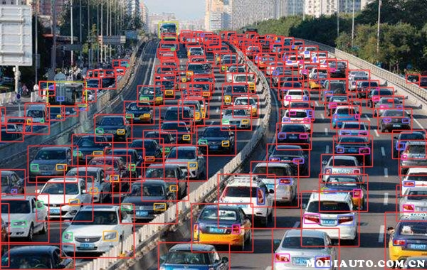

# Car Light Det
**Car light detect based on yolov8！**

## 效果展示


## 1. Train bdd100k
### 1.1 bdd100k dataset structure
```txt
bdd100k
└── images
    ├── images
    │   ├── train
    │   │   └── 0a0a0b1a-7c39d841.jpg
    │   └── val
    │       └── b1c9c847-3bda4659.jpg
    └── labels
        ├── bdd100k_labels_images_train.json
        └── bdd100k_labels_images_val.json
```
### 1.2 train
```bash
python train_bdd.py
```

## 2. 车灯训练
略
```txt
Classes：
  0: rect_1_indicat_T   #左前车灯_转向灯_开启
  1: rect_1_indicat_F   #左前车灯_转向灯_关闭
  2: rect_1_head_l_T    #左前车灯_前照灯_开启
  3: rect_1_head_l_F    #左前车灯_前照灯_关闭
  4: rect_2_indicat_T   #右前车灯_转向灯_开启
  5: rect_2_indicat_F   #右前车灯_转向灯_关闭
  6: rect_2_head_l_T    #右前车灯_前照灯_开启
  7: rect_2_head_l_F    #右前车灯_前照灯_关闭  
  8: rect_3_indicat_T   #左后车灯_转向灯_开启
  9: rect_3_indicat_F   #左后车灯_转向灯_关闭
  10: rect_3_stop_l_T   #左后车灯_刹车灯_开启
  11: rect_3_stop_l_F   #左后车灯_刹车灯_关闭
  12: rect_3_cleara_l_T #左后车灯_示廓灯_开启
  13: rect_3_cleara_l_F #左后车灯_示廓灯_关闭
  14: rect_4_indicat_T  #右后车灯_转向灯_开启
  15: rect_4_indicat_F  #右后车灯_转向灯_关闭
  16: rect_4_stop_l_T   #右后车灯_刹车灯_开启
  17: rect_4_stop_l_F   #右后车灯_刹车灯_关闭
  18: rect_4_cleara_l_T #右后车灯_示廓灯_开启
  19: rect_4_cleara_l_F #右后车灯_示廓灯_关闭
  20: rect_5_stop_l_T   #高位车灯_刹车灯_开启
```

## 3. 推理
```bash
python inference.py
```


